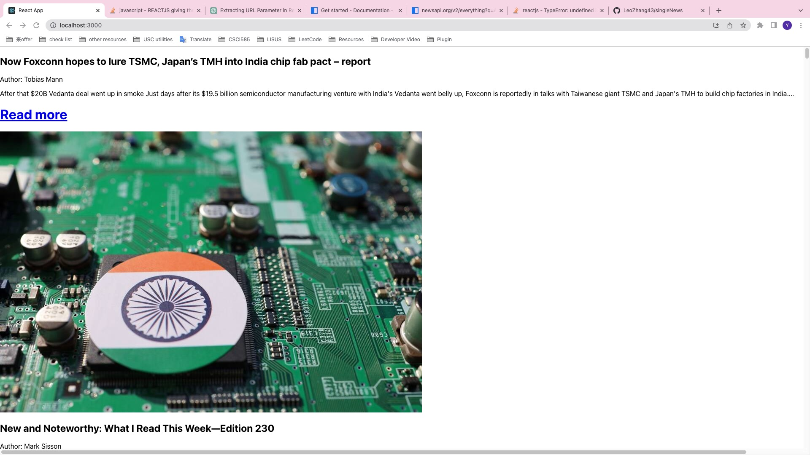
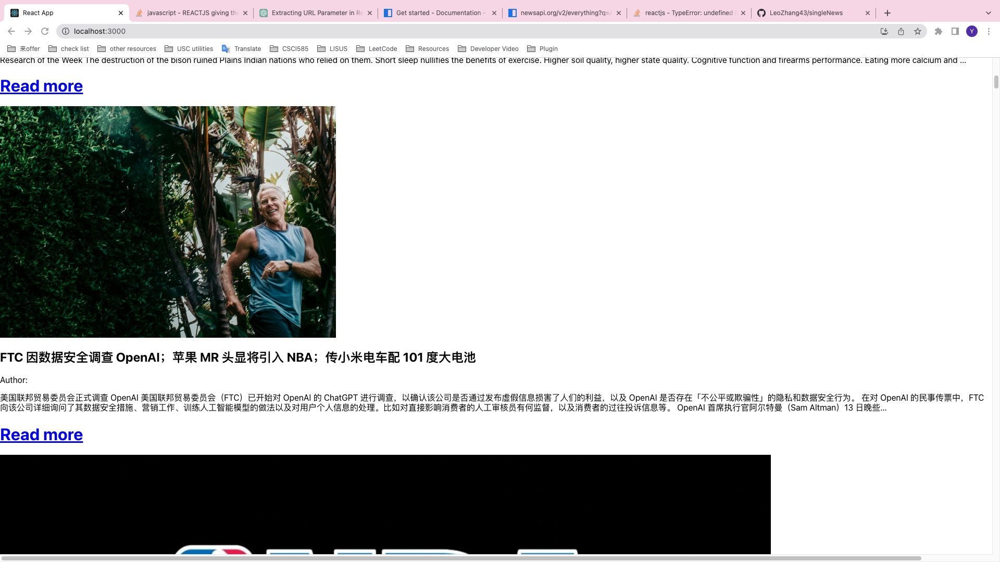
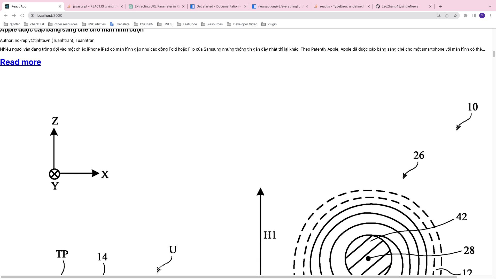

write a react app that could fetch single news based on its id
1.read data from an URL and pass the data into a products_context
2.export the data and read it using a map
3.pass the id and other variables into a product page
4.link to '/${id}', so that the id could be tracked in react-router-dom
5.export the ids from useParams()
6.attach the id to a single product URL like 'https://id:'
7.get data from that URL

